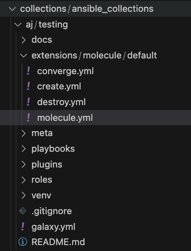

# Getting Started With Molecule

The following guide will step through an example of developing and
testing a new Ansible collection. After reading this guide, you should be
familiar with the basics of how to use Molecule and what it can offer.

1.  Create a collection

    One of the recommended ways to create a collection is to place it under a `collections/ansible_collections` directory. If you don't put your collection into a directory named `ansible_collections`, _molecule won't be able to find your role_.

    ```bash
      ansible-galaxy collection init foo.bar
    ```

- cd to the `roles` directory in your new collection.

- Initialize a new role for this collection.

      ```bash
        ansible-galaxy role init my_role
      ```

- Add a task under `my_role/tasks/main.yml`.

      ```yml
      ---
      - name: Task is running from within the role
        ansible.builtin.debug:
          msg: "This is a task from my_role."
      ```

- At the root of your new collection, create a directory named `playbooks`.

- cd to the `playbooks` directory and create a new playbook called `my_playbook.yml`

      ```yml
      ---
      - name: Test new role from within this playbook
        hosts: localhost
        gather_facts: false
        tasks:
          - name: Testing role
            ansible.builtin.include_role:
              name: foo.bar.my_role
              tasks_from: main.yml
      ```

- Adding Molecule to the Collection

      1. Create a new directory in your collection called `extensions`.

      2. cd to the `extensions` directory and initialize a new default molecule scenario.

          ```bash
             molecule init scenario
          ```



Before moving to test the playbooks or roles, the sections below provide information related to Scenarios.

## Molecule Scenarios

Scenarios are the starting point for a lot of powerful functionality that Molecule offers.
For now, we can think of a scenario as a test suite for roles or playbooks within a collection.
You can have as many scenarios as you like and Molecule will run one after the other.

## The Scenario Layout

Within the `molecule/default` folder, we find several files and
directories:

```bash
$ ls
create.yml  destroy.yml  molecule.yml  converge.yml
```

- `create.yml` is a playbook file used for creating the instances
  and storing data in instance-config
- `destroy.yml` has the Ansible code for destroying the instances
  and removing them from instance-config
- `molecule.yml` is the central configuration entry point for Molecule per scenario.
  With this file, you can configure each tool that Molecule will
  employ when testing your role.
- `converge.yml` is the playbook file that contains the call for your
  role. Molecule will invoke this playbook with `ansible-playbook` and
  run it against an instance created by the driver.

!!! note

    If the `verify.yml` playbook does not explicitly `include_role` your
    role, the `library` and `module_utils` provided by your role are not
    available in the playbook by default. If you need those for testing but
    would like to avoid re-running your role, consider adding an empty task
    file `init.yml` to your role and use `tasks_from` to include your role
    in the `verify.yml` playbook:

    ``` yaml
    - name: Verify
        hosts: all
        become: true
        tasks:
        - name: Initialize role without actually running it
          ansible.builtin.include_role:
            name: my_role
            tasks_from: init

    # Start testing: can use role library now
    ```

## Inspecting the `molecule.yml`

The `molecule.yml` is for configuring Molecule. It is a
[YAML](https://yaml.org/) file whose keys represent the high-level
components that Molecule provides. These are:

- The [dependency](configuration.md#dependency) manager. Molecule
  uses [galaxy development guide]
  by default to resolve your role dependencies.
- The [driver](configuration.md#driver) provider. Molecule uses
  the [Delegated](configuration.md#delegated) driver by default.
  Molecule uses the driver to delegate the task of creating instances.
- The [platforms](configuration.md#platforms) definitions. Molecule
  relies on this to know which instances to create, name and to which
  group each instance belongs. If you need to test your role against
  multiple popular distributions (CentOS, Fedora, Debian), you can
  specify that in this section.
- The [provisioner](configuration.md#provisioner). Molecule only
  provides an Ansible provisioner. Ansible manages the life cycle of
  the instance based on this configuration.
- The [scenario][] definition.
  Molecule relies on this configuration to control the scenario
  sequence order.
- The [verifier](configuration.md#verifier) framework. Molecule
  uses Ansible by default to provide a way to write specific state
  checking tests (such as deployment smoke tests) on the target
  instance.

## Run a full test sequence

Molecule provides commands for manually managing the lifecycle of the
instance, scenario, development and testing tools. However, we can also
tell Molecule to manage this automatically within a
scenario sequence.

cd to the `extensions` directory.

The full lifecycle sequence can be invoked with:

```bash
molecule test
```

```
Molecule full lifecycle sequence
└── default
    ├── dependency
    ├── cleanup
    ├── destroy
    ├── syntax
    ├── create
    ├── prepare
    ├── converge
    ├── idempotence
    ├── side_effect
    ├── verify
    ├── cleanup
    └── destroy
```

!!! note

    It can be particularly useful to pass the `--destroy=never` flag when
    invoking `molecule test` so that you can tell Molecule to run the full
    sequence but not destroy the instance if one step fails.

    If the `--platform-name=[PLATFORM_NAME]` flag is passed or the
    environment variable `MOLECULE_PLATFORM_NAME` is exposed when invoking
    `molecule test`, it can tell Molecule to run the test in one platform
    only. It is useful if you want to test one platform docker image.

[galaxy development guide]: https://docs.ansible.com/ansible/latest/galaxy/dev_guide.html

## Test the collection playbook or role

So you now have an isolated test environment, and can also use it for live development, by running `molecule converge`.
It will run through the same steps as above but will stop after the `converge` action.
Then you can make changes to your collection or the Converge play, and then run molecule converge again (and again) until you're done with your development work.

One of the default files created as part of the initialization is the `converge.yml` file.
This file is a playbook created to run your role from start to finish.
This can be modified if needed but is a good place to start if you have never used Molecule before.

To test the playbook, we update `converge.yml`:

```yml
---
- name: Include a playbook from a collection
  ansible.builtin.import_playbook: foo.bar.my_playbook
```

Similarly, if we want to test only the role instead of a playbook in `converge.yml` file:

```yml
---
- name: Include a role from a collection
  hosts: localhost
  gather_facts: false
  tasks:
    - name: Testing role
      ansible.builtin.include_role:
        name: foo.bar.my_role
        tasks_from: main.yml
```

cd to the `extensions` directory.

```bash
molecule converge
```

The above command runs the same steps as `molecule test` for the `default` scenario, but will stop after the `converge` action.
