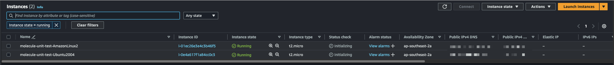

## Using molecule with AWS EC2 Instances

### Introduction

This guide will show you how to use molecule with AWS EC2 instances to test your Ansible roles and playbooks.

### Prerequisites

!!! note

    You will need to have the AWS CLI Tools installed and configured and this guide does not cover this topic or how to create an IAM user.
    Please refer to the [official AWS documentation](https://docs.aws.amazon.com/cli/latest/userguide/cli-configure-files.html) for instructions on how to do this.

Utilise [pip](https://pip.pypa.io/en/stable/installation/) to install boto3 and botocore packages.

```bash
pip install boto3 botocore
```

Utilise [pip](https://pip.pypa.io/en/stable/installation/) to install the molecule ec2 drivers.

```bash
pip install molecule molecule-drivers[ec2]
```

### Molecule EC2 Guide

Create a new role with molecule specifying the ec2 driver.

```bash
molecule init scenario -d ec2
```

This will create a stock standard molecule scenario, but you will still need to add and update other files within the molecule directory
as there are some missing files and configurations that are required to run molecule with the ec2 driver effectively.

The molecule directory should look like this once the steps below are completed:

```bash
    molecule/
    └── default/
        ├── templates
        │   └── iam_role_ec2_trust_policy.json.j2
        ├── converge.yml
        ├── create.yml
        ├── destroy.yml
        ├── molecule.yml
        └── prepare.yml
```

Create a templates folder under the molecule's scenario directory

```bash
    mkdir -p molecule/default/templates
```

Create a file called `iam_role_ec2_trust_policy.json.j2` under the templates folder. When molecule runs the create step, ansible will create
a IAM Role that will be attached to the instance (as per AWS Best Practices) The instance can use this role to access AWS resources (if required).

```json title="iam_role_ec2_trust_policy.json.j2"
{!../molecule/aws_ec2/templates/iam_role_ec2_trust_policy.json.j2!}
```

!!! note

    By default this role attaches the `AmazonSSMManagedInstanceCore` policy to the role. This will
    allow you to use SSM to access the instance via the AWS console if required. Refer to
    [AWS SSM - Session Manager Documentation](https://docs.aws.amazon.com/systems-manager/latest/userguide/session-manager.html)
    for more information

Update the `create.yml` file with the codeblock below. When molecule runs the create step the following actions will occur.

- Create a security group called `molecule`
- Create a temporary SSH Key Pair that is uploaded to the AWS Console
- Create the IAM Role called `molecule-unit-test-ec2-role`. As stated above this will be attached to the instance
- Create the EC2 Instance

```yaml
{!../molecule/aws_ec2/create.yml!}
```

Update the `destroy.yml` file with the codeblock below. When molecule runs the destroy step, it will clean up all the temporary resources
that it created within the create step.

```yaml
{!../molecule/aws_ec2/destroy.yml!}
```

Update the `molecule.yml`. This file is the main configuration file for molecule. It specifies the driver, which AMIs to use,
which vpc and subnet's to use etc. The codeblock below shows a working example that ties all the above steps together.

```yaml
{!../molecule/aws_ec2/molecule.yml!}
```

Utilise the normal molecule commands to test your role.

```bash
molecule create
molecule converge
molecule verify
molecule destroy
```

If you check the AWS EC2 Console you will see the instance that molecule created with the naming convention `molecule-unit-test-<%OS%>`

